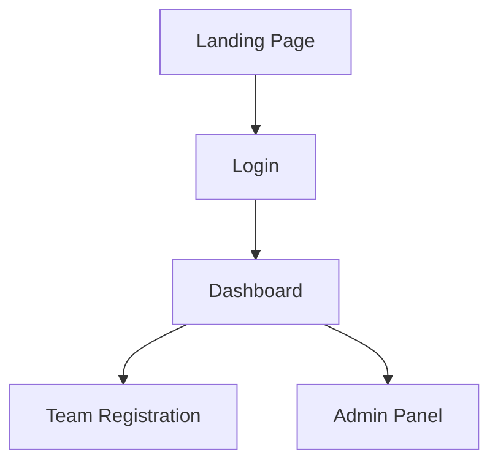

# Minimal Aesthetic Next.js Website Plan

## Objective
Create a minimal, aesthetic white-themed website using:
- Next.js (TypeScript)
- Tailwind CSS
- ShadcnUI
- Framer Motion
- Appwrite backend integration

---

## Todo List

1. **Analyze requirements and confirm minimal feature set for the initial website**
2. **Plan folder structure and dependencies**
   - Next.js (App Router)
   - TypeScript
   - Tailwind CSS
   - ShadcnUI
   - Framer Motion
   - Appwrite SDK
3. **Define minimal UI layout and navigation**
   - White theme, minimal aesthetic
   - Simple navigation bar
4. **Specify backend integration points**
   - Appwrite collections (institutions, teams, members, config, themes, gallery)
   - Authentication (Appwrite Auth)
   - Data fetch for dashboard and registration
5. **Draft wireframe or Mermaid diagram for main pages and flows**
6. **List initial pages/components to implement**
   - Login
   - Dashboard
   - Team Registration
   - Admin Panel
   - Minimal error/loading states
7. **Prepare implementation guidelines for code mode**
8. **Review plan and request mode switch for implementation**

---

## Example Mermaid Diagram

---

## Implementation Guidelines

- Use minimal color palette (white, light gray, subtle accent)
- Prioritize whitespace and clean typography
- Use Framer Motion for subtle transitions
- Integrate Appwrite for authentication and data
- Keep UI components minimal and accessible

---
